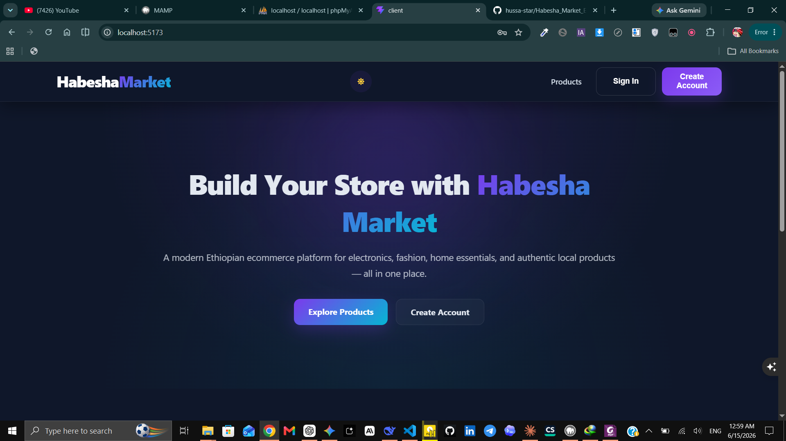
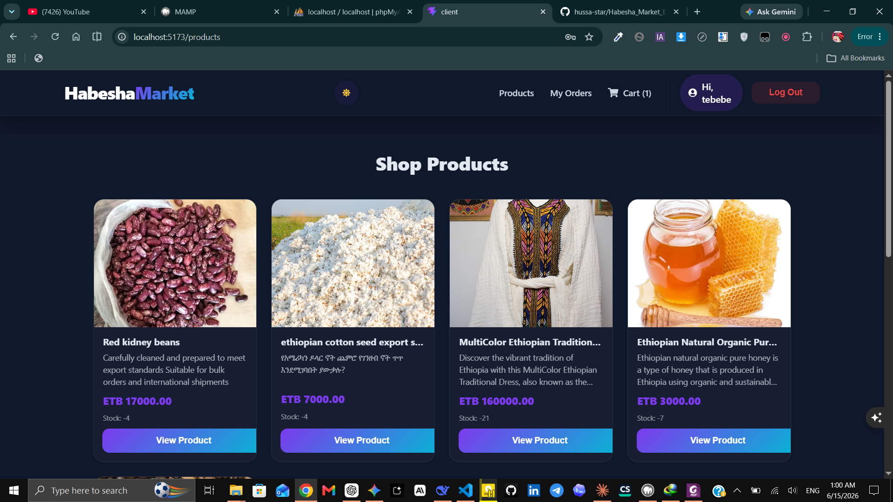
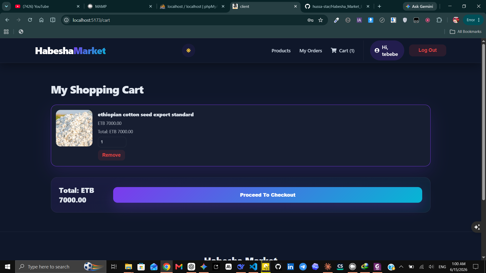
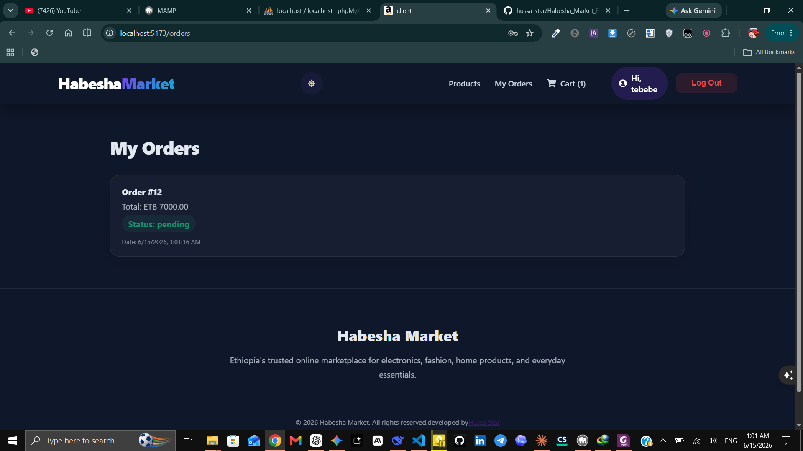
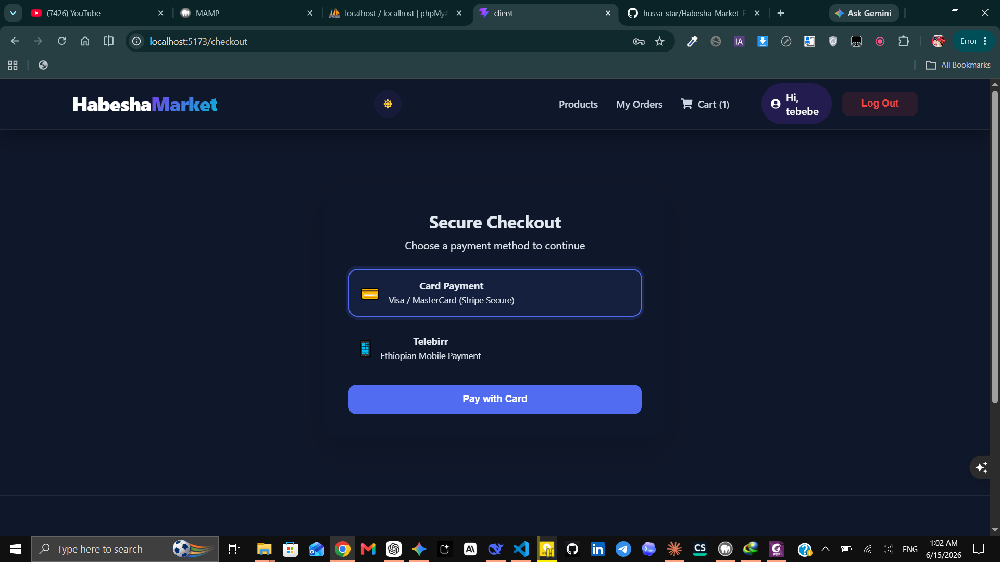
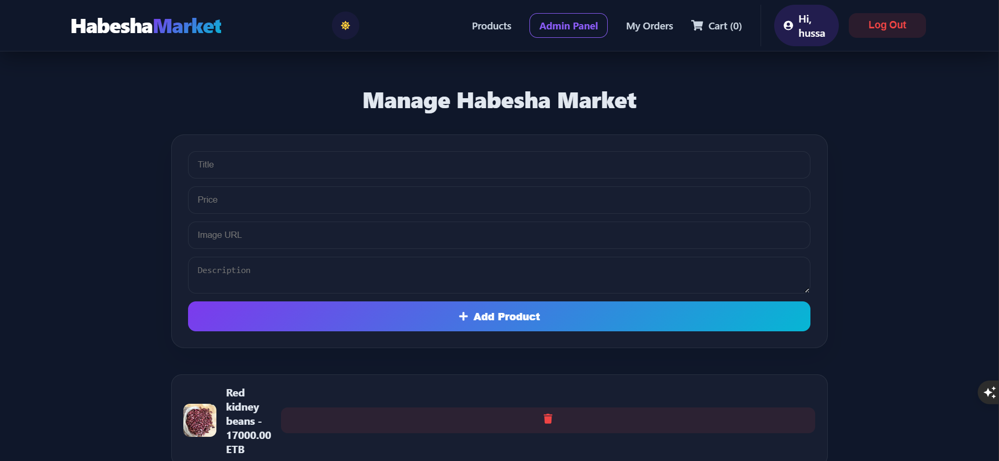

# Habesha Market 🛒

A full-stack e-commerce platform built with React + Vite and Node.js + Express + MySQL. Features product browsing, cart management, order placement, and Stripe payment integration.

---

## 📸 Preview


| Page     | Screenshot               |
| -------- | ------------------------ |
| Landing  |  |
| Products |  |
| Cart     |  |
| Orders   |  |
| Checkout |  |
| Admin    |  |

---

## ✨ Features

- 🔐 **User Authentication** — Register, login, and JWT-protected sessions
- 🛍️ **Product Browsing** — View all products and individual product details
- 🛒 **Cart Management** — Add, update quantity, and remove items from cart
- 📦 **Order Placement** — Checkout from cart and create orders automatically
- 💳 **Stripe Payments** — Secure payment flow with success and cancel pages
- 🔑 **Admin Panel** — Admin-only routes for product management (create, update, delete)
- 🌙 **Dark / Light Mode** — Theme toggle saved to localStorage
- 📱 **Fully Responsive** — Mobile-friendly layout across all pages
- 🔒 **Protected Routes** — Unauthenticated users redirected to login automatically

---

## 🛠️ Tech Stack

### Frontend

| Tool            | Purpose                      |
| --------------- | ---------------------------- |
| React 18        | UI library                   |
| Vite            | Build tool and dev server    |
| React Router v6 | Client-side routing          |
| Axios           | HTTP requests to the backend |
| CSS Modules     | Scoped component styles      |
| react-spinners  | Loading indicators           |

### Backend

| Tool               | Purpose                                 |
| ------------------ | --------------------------------------- |
| Node.js + Express  | Server framework                        |
| MySQL2             | Database driver with connection pooling |
| JWT (jsonwebtoken) | Stateless authentication tokens         |
| bcrypt             | Password hashing                        |
| Stripe             | Payment processing                      |
| http-status-codes  | Semantic HTTP status constants          |
| dotenv             | Environment variable management         |
| cors               | Cross-origin request handling           |

---

## 📁 Project Structure

```
Ecommerce_APP/
│
├── client/                             # React Vite frontend
│   └── src/
│       ├── components/
│       │   ├── Layout/                 # Wraps Header + Outlet + Footer
│       │   └── ProtectedRoute/         # Redirects unauthenticated users to /login
│       ├── pages/
│       │   ├── Landing/                # Public hero page
│       │   ├── Products/               # All products grid (protected)
│       │   ├── ProductDetails/         # Single product view + add to cart (protected)
│       │   ├── Cart/                   # Cart items + checkout button (protected)
│       │   ├── Checkout/               # Order summary before payment (protected)
│       │   ├── Orders/                 # Order history (protected)
│       │   ├── Admin/                  # Admin product management (admin only)
│       │   ├── Success/                # Stripe payment success page
│       │   └── Cancel/                 # Stripe payment cancelled page
│       ├── App.jsx                     # Route definitions
│       ├── axiosConfig.js              # Axios instance with base URL from .env
│       └── main.jsx                    # Entry point with BrowserRouter + AuthProvider
│
└── server/                             # Node.js Express backend
    └── src/
        ├── app.js                      # Express entry point — routes + error handling
        ├── Config/
        │   └── DbConfig.js             # MySQL2 connection pool
        ├── Errors/
        │   └── AppError.js             # Custom error class with statusCode + isOperational
        ├── Utils/
        │   ├── asyncHandler.js         # Wraps controllers — eliminates try/catch
        │   ├── generateToken.js        # JWT token creation
        │   ├── sendResponse.js         # Standardized response helper
        │   └── stripe.js               # Stripe instance initialization
        ├── Middleware/
        │   ├── authMiddleware.js       # JWT verification + req.user injection
        │   ├── isAdmin.js              # Admin role check (req.user.role === "admin")
        │   ├── errorMiddleware.js      # Global error handler (registered last in app.js)
        │   └── notFoundMiddleware.js   # 404 handler for unmatched routes
        ├── Models/                     # Raw SQL queries — no logic, just database access
        │   ├── userModel.js
        │   ├── productModel.js
        │   ├── orderModel.js
        │   └── cartModel.js
        ├── Services/                   # Business logic layer
        │   ├── userService.js
        │   ├── productService.js
        │   ├── orderService.js
        │   ├── paymentService.js
        │   └── cartService.js
        ├── Controllers/                # Thin: validate → call service → respond
        │   ├── userControllers.js
        │   ├── productControllers.js
        │   ├── orderControllers.js
        │   ├── paymentControllers.js
        │   └── cartControllers.js
        └── Routes/                     # URL + HTTP method → controller mapping
            ├── userRoutes.js
            ├── productRoutes.js
            ├── orderRoutes.js
            ├── paymentRoutes.js
            └── cartRoutes.js
```

---

## ⚙️ Getting Started

### Prerequisites

- [Node.js](https://nodejs.org/) v18+
- [MySQL](https://www.mysql.com/) v8+
- [Stripe account](https://stripe.com/) for payment keys
- npm v9+

---

### 1. Clone the repository

```bash
git clone https://github.com/hussa-star/Habesha_Market_Ecommerce_APp.git
cd habesha-market
```

---

### 2. Set up the database

Open your MySQL client and run:

```sql
CREATE TABLE users (
    userid INT AUTO_INCREMENT PRIMARY KEY,
    username VARCHAR(100) NOT NULL,
    email VARCHAR(100) UNIQUE NOT NULL,
    password VARCHAR(255) NOT NULL,
    role VARCHAR(50) DEFAULT 'user',
    created_at TIMESTAMP DEFAULT CURRENT_TIMESTAMP
);

CREATE TABLE products (
    productid INT AUTO_INCREMENT PRIMARY KEY,
    title VARCHAR(255) NOT NULL,
    description TEXT,
    price DECIMAL(10,2) NOT NULL,
    image VARCHAR(500),
    stock INT DEFAULT 0,
    created_at TIMESTAMP DEFAULT CURRENT_TIMESTAMP
);

CREATE TABLE orders (
    orderid INT AUTO_INCREMENT PRIMARY KEY,
    userid INT NOT NULL,
    total_price DECIMAL(10,2),
    status VARCHAR(50) DEFAULT 'pending',
    created_at TIMESTAMP DEFAULT CURRENT_TIMESTAMP,
    payment_method VARCHAR(50),
    payment_status VARCHAR(50) DEFAULT 'pending',

    FOREIGN KEY(userid)
    REFERENCES users(userid)
    ON DELETE CASCADE
);

CREATE TABLE order_items (
    id INT AUTO_INCREMENT PRIMARY KEY,
    orderid INT NOT NULL,
    productid INT NOT NULL,
    quantity INT NOT NULL,
    price DECIMAL(10,2),

    FOREIGN KEY(orderid)
    REFERENCES orders(orderid)
    ON DELETE CASCADE,

    FOREIGN KEY(productid)
    REFERENCES products(productid)
    ON DELETE CASCADE
);

CREATE TABLE payments (
    paymentid INT AUTO_INCREMENT PRIMARY KEY,
    orderid INT NOT NULL,
    amount DECIMAL(10,2),
    payment_method VARCHAR(50),
    payment_status VARCHAR(50) DEFAULT 'pending',

    FOREIGN KEY(orderid)
    REFERENCES orders(orderid)
    ON DELETE CASCADE
);

CREATE TABLE cart (
    cartid INT AUTO_INCREMENT PRIMARY KEY,
    userid INT NOT NULL,
    productid INT NOT NULL,
    quantity INT DEFAULT 1,

    FOREIGN KEY(userid) REFERENCES users(userid) ON DELETE CASCADE,
    FOREIGN KEY(productid) REFERENCES products(productid) ON DELETE CASCADE
);


```

---

### 3. Configure the backend environment

Create a `.env` file inside `server/`:

```env
# Database
DB_HOST=localhost
DB_USER=root
DB_PASSWORD=your_mysql_password
DB_DATABASE=habesha_market
DB_PORT=3306

# Auth
JWT_SECRET=your_super_secret_key_here

# Stripe
STRIPE_SECRET_KEY=sk_test_your_stripe_secret_key
STRIPE_PUBLISHABLE_KEY=pk_test_your_stripe_publishable_key

# Server
PORT=5000
```

---

### 4. Install and start the backend

```bash
cd server
npm install
npm run dev
```

You should see:

```
Database connected successfully
Server running on port 5000
```

---

### 5. Configure the frontend environment

Create a `.env` file inside `client/`:

```env
VITE_API_URL=http://localhost:5000/api
VITE_STRIPE_PUBLISHABLE_KEY=pk_test_your_stripe_publishable_key
```

---

### 6. Install and start the frontend

```bash
cd client
npm install
npm run dev
```

App runs at: `http://localhost:5173`

---

## 🔌 API Endpoints

### Users — `/api/users`

| Method | Endpoint    | Auth | Description                    |
| ------ | ----------- | ---- | ------------------------------ |
| POST   | `/register` | ❌   | Register a new user            |
| POST   | `/login`    | ❌   | Login and receive JWT token    |
| GET    | `/check`    | ✅   | Verify token and get user info |

### Products — `/api/products`

| Method | Endpoint | Auth  | Description                 |
| ------ | -------- | ----- | --------------------------- |
| GET    | `/`      | ❌    | Get all products            |
| GET    | `/:id`   | ❌    | Get single product          |
| POST   | `/`      | ✅ 👑 | Create product (admin only) |
| PUT    | `/:id`   | ✅ 👑 | Update product (admin only) |
| DELETE | `/:id`   | ✅ 👑 | Delete product (admin only) |

### Cart — `/api/cart`

| Method | Endpoint | Auth | Description           |
| ------ | -------- | ---- | --------------------- |
| POST   | `/`      | ✅   | Add item to cart      |
| GET    | `/`      | ✅   | Get user's cart items |
| PUT    | `/:id`   | ✅   | Update item quantity  |
| DELETE | `/:id`   | ✅   | Remove item from cart |

### Orders — `/api/orders`

| Method | Endpoint | Auth | Description                          |
| ------ | -------- | ---- | ------------------------------------ |
| POST   | `/`      | ✅   | Create order from cart (clears cart) |
| GET    | `/`      | ✅   | Get all orders for logged-in user    |
| GET    | `/:id`   | ✅   | Get single order with items          |

### Payments — `/api/payments`

| Method | Endpoint    | Auth | Description                        |
| ------ | ----------- | ---- | ---------------------------------- |
| POST   | `/`         | ✅   | Create Stripe session for an order |
| GET    | `/:orderid` | ✅   | Get payment details for an order   |

> ✅ = requires `Authorization: Bearer <token>` header
> 👑 = also requires admin role

---

## 💳 Payment Flow

```
1. User adds items to cart
2. User clicks "Checkout" → POST /api/orders
   └── Creates order, clears cart, returns { orderid, total }
3. User clicks "Pay" → POST /api/payments { orderid }
   └── Creates Stripe session, returns { url }
4. Frontend redirects to Stripe hosted checkout page
5. Payment succeeds → Stripe redirects to /success
6. Payment cancelled → Stripe redirects to /cancel
```

---

## 🏗️ Backend Architecture

```
Request → Route → Middleware → Controller → Service → Model → Database
                                   ↑              ↑
                               Validator       AppError
                                                   ↓
                                           errorMiddleware
```

| Layer                  | Job                                                         |
| ---------------------- | ----------------------------------------------------------- |
| **Route**              | Maps URL + HTTP method to a controller function             |
| **authMiddleware**     | Verifies JWT, injects `req.user`                            |
| **isAdmin**            | Checks `req.user.role === "admin"`                          |
| **Controller**         | Validate → call service → send response (thin, no logic)    |
| **Service**            | Business logic: duplicate checks, calculations, decisions   |
| **Model**              | Raw SQL queries only — no logic                             |
| **asyncHandler**       | Wraps controllers so thrown errors reach `errorMiddleware`  |
| **AppError**           | Custom error class with `statusCode` + `isOperational` flag |
| **errorMiddleware**    | One place that handles all errors and sends responses       |
| **notFoundMiddleware** | Catches unmatched routes and throws 404                     |

---

## 🌐 Frontend Architecture

```
BrowserRouter
  └── AuthProvider (global user context via React Context)
        └── Layout (Header + Outlet + Footer)
              ├── /                    → Landing (public)
              ├── /register            → Register (public)
              ├── /login               → Login (public)
              ├── /products            → ProtectedRoute → Products
              ├── /products/:id        → ProtectedRoute → ProductDetails
              ├── /cart                → ProtectedRoute → Cart
              ├── /checkout            → ProtectedRoute → Checkout
              ├── /orders              → ProtectedRoute → Orders
              ├── /admin               → ProtectedRoute → Admin
              ├── /success             → Success
              └── /cancel              → Cancel
```

**Auth flow:**

1. User logs in → backend returns JWT token
2. Token saved to `localStorage`
3. `AuthProvider` calls `/api/users/check` on mount to restore session
4. `ProtectedRoute` verifies auth before rendering any protected page
5. All protected API calls include `Authorization: Bearer <token>` header

---

## 📦 Install Dependencies

### Backend

```bash
cd server
npm install express mysql2 dotenv cors bcrypt jsonwebtoken stripe http-status-codes
npm install --save-dev nodemon
```

### Frontend

```bash
cd client
npm install axios react-router-dom react-spinners react-icons
```

---

## 🔑 Creating an Admin User

After registering a normal user, update their role directly in MySQL:

```sql
UPDATE users SET role = 'admin' WHERE email = 'your@email.com';
```

---

## 🤝 Contributing

1. Fork the repository
2. Create a feature branch: `git checkout -b feature/your-feature`
3. Commit your changes: `git commit -m "Add your feature"`
4. Push to the branch: `git push origin feature/your-feature`
5. Open a Pull Request

---

## 📄 License

This project is open source and available under the [MIT License](LICENSE).

---

## 👤 Author

**Hussien**

- GitHub: [@your-username](https://github.com/hussa-star)

---

> Built to practice full-stack architecture — layered backend, protected routes, real payments.
